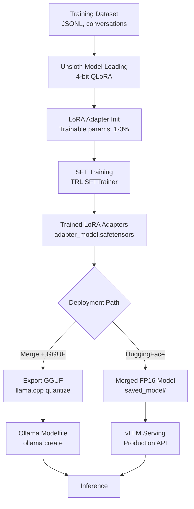

# Fine-Tuning Open Source LLMs: From Llama to Production

The promise of open source LLMs is not just that they are free — it is that you can modify them. Fine-tuning lets you take a capable base model and adapt it to your domain, your output format, and your quality standards in a way that prompt engineering alone cannot achieve. A well-fine-tuned 8B model often outperforms a prompted 70B model on a specific task while running on a fraction of the hardware.

The practical barrier has historically been compute cost. Training a 7B model from scratch requires hundreds of GPUs for weeks. Parameter-efficient fine-tuning methods — specifically LoRA (Low-Rank Adaptation) and its 4-bit quantized variant QLoRA — changed this. You can now fine-tune a Llama 3 8B model on a single 24GB GPU for a few dollars of cloud compute. The Unsloth library reduces memory requirements further, enabling QLoRA fine-tuning on 16GB VRAM with 2× training speed improvements.

This guide covers the complete pipeline: preparing your dataset in the format Unsloth expects, running LoRA fine-tuning with TRL, merging the adapters back into the base model, exporting to GGUF format, and serving the result with Ollama. Every step includes runnable code.

---

## Concept Overview

**LoRA (Low-Rank Adaptation)** works by adding small trainable weight matrices to the frozen base model. Instead of updating all 8 billion parameters, LoRA inserts low-rank decompositions (rank 16–64) into specific attention layers. This reduces trainable parameters from billions to millions — typically 1–3% of the original model size — while preserving most fine-tuning effectiveness.

**QLoRA** extends LoRA by loading the base model in 4-bit quantization (NF4), further reducing memory requirements. A 7B model that requires 16GB VRAM in FP16 requires only 5–6GB in NF4, leaving VRAM headroom for the LoRA adapters and training overhead.

**Unsloth** is a library that optimizes QLoRA training through custom CUDA kernels and memory management. It provides 2× training speed and 60% memory reduction compared to standard QLoRA with HuggingFace/PEFT, with no quality difference.

**TRL (Transformer Reinforcement Learning)** is HuggingFace's training library that provides the `SFTTrainer` — a wrapper that handles the chat template formatting, tokenization, and training loop for supervised fine-tuning.

---

## How It Works



---

## Implementation Example

### Step 1: Environment Setup

```bash
# Install Unsloth (includes TRL, PEFT, transformers)
pip install "unsloth[colab-new] @ git+https://github.com/unslothai/unsloth.git"
pip install --no-deps trl peft accelerate bitsandbytes

# Or with conda (recommended for CUDA compatibility)
conda create --name llm-finetune python=3.11
conda activate llm-finetune
conda install pytorch pytorch-cuda=12.1 -c pytorch -c nvidia
pip install unsloth trl peft datasets
```

### Step 2: Dataset Preparation

```python
# dataset_prep.py
import json
from datasets import Dataset
from pathlib import Path

# Your training data format: list of conversation dicts
# The "sharegpt" format is natively supported by Unsloth
raw_data = [
    {
        "conversations": [
            {
                "from": "system",
                "value": "You are a Python expert. Write clean, production-ready code."
            },
            {
                "from": "human",
                "value": "Write a function that validates email addresses."
            },
            {
                "from": "gpt",
                "value": """import re

def validate_email(email: str) -> bool:
    \"\"\"
    Validate an email address using RFC 5322 compliant regex.

    Args:
        email: The email address string to validate.

    Returns:
        True if the email is valid, False otherwise.
    \"\"\"
    pattern = r'^[a-zA-Z0-9._%+-]+@[a-zA-Z0-9.-]+\\.[a-zA-Z]{2,}$'
    return bool(re.match(pattern, email.strip()))

# Examples
print(validate_email("user@example.com"))    # True
print(validate_email("invalid-email"))       # False
print(validate_email("user@.com"))           # False"""
            }
        ]
    },
    # Add more examples here (minimum 50, target 500–5000)
]

def prepare_dataset(data: list[dict], output_path: str) -> Dataset:
    """Prepare and validate training dataset."""
    # Validate format
    for i, example in enumerate(data):
        assert "conversations" in example, f"Example {i} missing 'conversations'"
        convs = example["conversations"]
        assert len(convs) >= 2, f"Example {i} needs at least 2 turns"
        assert any(c["from"] == "human" for c in convs), f"Example {i} missing human turn"
        assert any(c["from"] == "gpt" for c in convs), f"Example {i} missing assistant turn"

    # Save to JSONL
    output_file = Path(output_path)
    with open(output_file, "w") as f:
        for example in data:
            f.write(json.dumps(example) + "\n")

    # Load as HuggingFace Dataset
    dataset = Dataset.from_list(data)
    print(f"Dataset: {len(dataset)} examples")
    return dataset

dataset = prepare_dataset(raw_data, "./training_data.jsonl")
```

### Step 3: LoRA Fine-Tuning with Unsloth

```python
# train.py
from unsloth import FastLanguageModel
from trl import SFTTrainer
from transformers import TrainingArguments
from datasets import load_dataset
import torch

# Configuration
MODEL_NAME = "unsloth/Meta-Llama-3.1-8B-Instruct"
OUTPUT_DIR = "./lora_adapters"
MAX_SEQ_LENGTH = 2048
DTYPE = None           # Auto-detect (bfloat16 on Ampere+)
LOAD_IN_4BIT = True    # QLoRA

# Load model with Unsloth
model, tokenizer = FastLanguageModel.from_pretrained(
    model_name=MODEL_NAME,
    max_seq_length=MAX_SEQ_LENGTH,
    dtype=DTYPE,
    load_in_4bit=LOAD_IN_4BIT,
)

# Add LoRA adapters
model = FastLanguageModel.get_peft_model(
    model,
    r=16,                  # LoRA rank — higher = more capacity, more memory
    target_modules=[
        "q_proj", "k_proj", "v_proj", "o_proj",
        "gate_proj", "up_proj", "down_proj",
    ],
    lora_alpha=16,
    lora_dropout=0,        # Unsloth recommends 0 for optimal speed
    bias="none",
    use_gradient_checkpointing="unsloth",  # Saves VRAM at small speed cost
    random_state=42,
    use_rslora=False,      # Set True for rank-stabilized LoRA on high ranks
)

model.print_trainable_parameters()
# Typical output: trainable params: 41,943,040 || all params: 8,071,680,000 (0.52%)

# Load dataset
dataset = load_dataset("json", data_files="./training_data.jsonl", split="train")

# Training arguments
training_args = TrainingArguments(
    output_dir=OUTPUT_DIR,
    num_train_epochs=3,
    per_device_train_batch_size=2,
    gradient_accumulation_steps=4,       # Effective batch size = 2*4 = 8
    learning_rate=2e-4,
    fp16=not torch.cuda.is_bf16_supported(),
    bf16=torch.cuda.is_bf16_supported(),
    logging_steps=10,
    optim="adamw_8bit",                  # 8-bit optimizer saves ~1GB VRAM
    weight_decay=0.01,
    lr_scheduler_type="linear",
    warmup_steps=5,
    save_steps=100,
    save_total_limit=3,
    report_to="none",
)

# SFT Trainer with chat template formatting
trainer = SFTTrainer(
    model=model,
    tokenizer=tokenizer,
    train_dataset=dataset,
    dataset_text_field="conversations",
    max_seq_length=MAX_SEQ_LENGTH,
    dataset_num_proc=2,
    args=training_args,
)

# Train
print("Starting fine-tuning...")
trainer_stats = trainer.train()
print(f"Training complete. Loss: {trainer_stats.training_loss:.4f}")

# Save LoRA adapters only
model.save_pretrained(OUTPUT_DIR)
tokenizer.save_pretrained(OUTPUT_DIR)
print(f"LoRA adapters saved to {OUTPUT_DIR}")
```

### Step 4: Merge Adapters and Export to GGUF

```python
# merge_and_export.py
from unsloth import FastLanguageModel

MODEL_NAME = "unsloth/Meta-Llama-3.1-8B-Instruct"
ADAPTER_PATH = "./lora_adapters"
MERGED_PATH = "./merged_model"
GGUF_PATH = "./models"

# Load the fine-tuned model with adapters
model, tokenizer = FastLanguageModel.from_pretrained(
    model_name=MODEL_NAME,
    max_seq_length=2048,
    dtype=None,
    load_in_4bit=True,
)

# Load LoRA adapter weights
from peft import PeftModel
model = PeftModel.from_pretrained(model, ADAPTER_PATH)

# Option 1: Merge and save as FP16 (for vLLM or HuggingFace serving)
model = model.merge_and_unload()
model.save_pretrained(MERGED_PATH, safe_serialization=True)
tokenizer.save_pretrained(MERGED_PATH)
print(f"Merged FP16 model saved to {MERGED_PATH}")

# Option 2: Export directly to GGUF (for Ollama serving) — Unsloth handles this
# Reload with Unsloth for the GGUF export path
model, tokenizer = FastLanguageModel.from_pretrained(
    model_name=MODEL_NAME,
    max_seq_length=2048,
    dtype=None,
    load_in_4bit=True,
)
from peft import PeftModel
model = PeftModel.from_pretrained(model, ADAPTER_PATH)

# Unsloth's native GGUF export
model.save_pretrained_gguf(
    GGUF_PATH,
    tokenizer,
    quantization_method="q4_k_m",   # Export as Q4_K_M (recommended)
)
print(f"GGUF model saved to {GGUF_PATH}")
```

### Step 5: Serve with Ollama

```dockerfile
# Modelfile.finetuned
FROM ./models/Meta-Llama-3.1-8B-Instruct-Q4_K_M.gguf

SYSTEM """
You are a Python expert. Write clean, production-ready Python code.
Always include type hints, docstrings, and error handling.
"""

PARAMETER temperature 0.3
PARAMETER num_ctx 4096
```

```bash
# Create the custom Ollama model
ollama create python-expert -f Modelfile.finetuned

# Test it
ollama run python-expert "Write a function to parse and validate ISO 8601 dates"

# Use via API
curl http://localhost:11434/v1/chat/completions \
  -H "Content-Type: application/json" \
  -d '{
    "model": "python-expert",
    "messages": [{"role": "user", "content": "Write a context manager for database connections"}]
  }'
```

### Step 6: Evaluate the Fine-Tuned Model

```python
import ollama
import json

def evaluate_finetuned_model(
    model: str,
    test_cases: list[dict],
) -> dict:
    """Compare fine-tuned model against base model on test cases."""
    results = []

    for case in test_cases:
        response = ollama.chat(
            model=model,
            messages=[{"role": "user", "content": case["prompt"]}]
        )["message"]["content"]

        # Check for expected characteristics
        checks = {
            "has_type_hints": "def " in response and ":" in response,
            "has_docstring": '"""' in response or "'''" in response,
            "has_error_handling": "try:" in response or "raise" in response,
            "is_python": "def " in response or "import" in response,
        }

        results.append({
            "prompt": case["prompt"][:80],
            "checks": checks,
            "passed": sum(checks.values()),
            "total": len(checks),
        })

    avg_pass_rate = sum(r["passed"] / r["total"] for r in results) / len(results)
    return {
        "model": model,
        "avg_pass_rate": round(avg_pass_rate, 3),
        "results": results,
    }

test_cases = [
    {"prompt": "Write a Python function to retry failed HTTP requests with exponential backoff."},
    {"prompt": "Create a Python class for a thread-safe LRU cache."},
    {"prompt": "Write a Python async function to process a queue of tasks concurrently."},
]

# Compare base vs fine-tuned
for model in ["llama3.1:8b", "python-expert"]:
    result = evaluate_finetuned_model(model, test_cases)
    print(f"\n{result['model']}: {result['avg_pass_rate']:.0%} characteristics match")
```

---

## Best Practices

**Start with a well-curated small dataset.** 500 high-quality examples outperforms 10,000 mediocre examples consistently. Prioritize diversity and quality over quantity.

**Use rank r=16 as a starting point.** Higher ranks (32, 64) increase model capacity and memory cost. For most fine-tuning tasks, r=16 is sufficient. Only increase rank if your eval shows the model is clearly underfitting.

**Validate on a held-out set before merging.** Run your eval suite on the LoRA adapter (before merging) against your held-out examples. Merging is irreversible — know your adapter quality before committing.

**Export to Q4_K_M GGUF for Ollama serving.** Unsloth's built-in GGUF export handles the conversion pipeline. Q4_K_M is the right default for production serving.

**Monitor training loss, not just final loss.** A loss that drops rapidly and then plateaus suggests learning rate is too high or dataset is too small. A loss that never converges suggests dataset quality issues or misconfigured tokenizer.

---

## Common Mistakes

1. **Fine-tuning the wrong model variant.** Always fine-tune instruct-tuned models (Llama-3.1-8B-**Instruct**) for chat/instruction applications. Fine-tuning a base model for instruction following starts from a much worse initialization.

2. **Using too small a dataset and expecting generalization.** With fewer than 100 examples, you are memorizing, not fine-tuning. The model will regress on tasks not in your training set. Use at least 200–500 diverse examples for any useful generalization.

3. **Not saving LoRA adapter weights separately before merging.** Once you merge and lose the adapter, you cannot recover it without retraining. Always save the adapter first (`model.save_pretrained(ADAPTER_PATH)`), then experiment with merging.

4. **Ignoring catastrophic forgetting.** Fine-tuning on a narrow domain can degrade the model's general capabilities. Include a small fraction of general-purpose examples in your training mix to slow forgetting.

5. **Setting a learning rate that is too high.** 2e-4 is a safe default. Higher learning rates cause the LoRA adapters to dominate the base model weights, producing erratic outputs. If your training loss spikes or becomes unstable, reduce the learning rate.

---

## Summary

Fine-tuning Llama 3 with Unsloth and TRL is now within reach of any team with a single mid-tier GPU. The full pipeline — dataset preparation, QLoRA training, adapter merging, GGUF export, Ollama serving — can be completed in a day of engineering work. The result is a custom model that performs your specific task reliably, runs on modest hardware, and operates entirely within your infrastructure.

---

## Related Articles

- [Open Source LLMs Guide: Complete Ecosystem Overview](/blog/open-source-llm-guide)
- [LLM Fine-Tuning Guide](/blog/llm-fine-tuning-guide)
- [LoRA Fine-Tuning Tutorial](/blog/lora-fine-tuning-tutorial)
- [Running LLMs Locally with Ollama: Complete Guide](/blog/ollama-tutorial)

---

## FAQ

**Q: How much GPU memory do I need for QLoRA fine-tuning?**
With Unsloth, a Llama 3.1 8B QLoRA fine-tuning run fits in 14–16GB VRAM. An RTX 3080 (10GB) can handle it with gradient checkpointing and a batch size of 1. An RTX 3090 or 4090 (24GB) is comfortable.

**Q: How long does fine-tuning take?**
For a 500-example dataset, 3 epochs on an RTX 4090 takes roughly 15–30 minutes with Unsloth. Larger datasets scale roughly linearly. Cloud GPU costs run $1–3 for a typical small fine-tuning run on Lambda Labs or RunPod.

**Q: Can I fine-tune on my MacBook with Apple Silicon?**
Yes, but slowly. Unsloth does not support MPS (Metal) currently — use the standard PEFT/TRL stack with `device_map="mps"`. Training speed is roughly 5–10× slower than an equivalent NVIDIA GPU. For small datasets (< 500 examples), this is feasible.

**Q: Should I merge adapters before deployment?**
For Ollama serving, yes — you need a merged model for GGUF export. For vLLM serving, you can serve the merged FP16 model directly. Keep the unmerged adapter weights so you can re-merge at different quantization levels or continue fine-tuning from the adapter checkpoint.

<script type="application/ld+json">
{
  "@context": "https://schema.org",
  "@type": "FAQPage",
  "mainEntity": [
    {
      "@type": "Question",
      "name": "How much GPU memory do I need for QLoRA fine-tuning?",
      "acceptedAnswer": {
        "@type": "Answer",
        "text": "With Unsloth, a Llama 3.1 8B QLoRA fine-tuning run fits in 14–16GB VRAM. An RTX 3090 or 4090 (24GB) is comfortable for training."
      }
    },
    {
      "@type": "Question",
      "name": "How long does fine-tuning take?",
      "acceptedAnswer": {
        "@type": "Answer",
        "text": "For a 500-example dataset, 3 epochs on an RTX 4090 takes roughly 15–30 minutes with Unsloth. Cloud GPU costs run $1–3 for a typical small fine-tuning run."
      }
    },
    {
      "@type": "Question",
      "name": "Can I fine-tune on my MacBook with Apple Silicon?",
      "acceptedAnswer": {
        "@type": "Answer",
        "text": "Yes, but slowly. Use the standard PEFT/TRL stack with device_map='mps'. Training speed is roughly 5–10× slower than an equivalent NVIDIA GPU. Feasible for small datasets under 500 examples."
      }
    },
    {
      "@type": "Question",
      "name": "Should I merge adapters before deployment?",
      "acceptedAnswer": {
        "@type": "Answer",
        "text": "For Ollama serving, yes — you need a merged model for GGUF export. For vLLM serving, you can serve the merged FP16 model directly. Always keep the unmerged adapter weights as a checkpoint."
      }
    }
  ]
}
</script>
