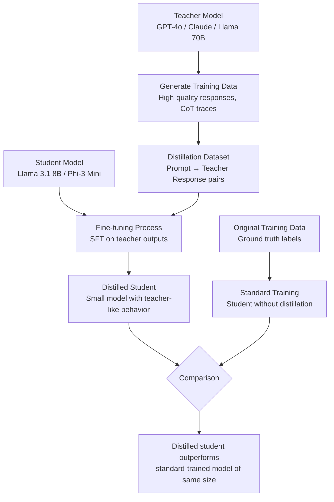

# Model Distillation Explained: Smaller Models, Similar Performance

The first question engineers ask when they see a model like Phi-4 scoring near GPT-4 levels on reasoning benchmarks at 14B parameters is: how is that possible? The answer, in significant part, is distillation. Not quantization — the model is not a compressed version of a larger model. The 14B model learned from a larger teacher, inheriting reasoning patterns that were not in the raw training data.

Knowledge distillation is a training technique, not an inference optimization. It is philosophically different from quantization and pruning: instead of making an existing model smaller, you train a smaller model to reproduce the behavior of a larger model. The student model learns from the teacher's outputs — its probability distributions over tokens, its reasoning traces, its chain-of-thought examples — rather than learning purely from ground-truth labels.

This distinction matters for production decisions. Distillation is expensive (it requires retraining or fine-tuning), but it can produce a small model with capabilities that punches far above what its parameter count suggests. Understanding when distillation is worth the investment — and when quantization or prompt engineering is sufficient — is a useful part of the AI engineer's toolkit.

---

## Concept Overview

Classic knowledge distillation (Hinton et al., 2015) transfers knowledge from a large "teacher" model to a smaller "student" model through two mechanisms:

**Soft targets** — Instead of training on one-hot labels (the correct answer is 1, everything else is 0), the student learns from the teacher's output probability distribution. If a teacher assigns 60% probability to "Paris," 30% to "Lyon," and 10% to other cities, the student learns both the correct answer and the model's uncertainty about alternatives. This provides richer training signal than binary labels.

**Intermediate layer matching** — Some distillation methods also match the student's internal representations (hidden states, attention patterns) to the teacher's. This is computationally more expensive but can transfer more nuanced capabilities.

For LLMs specifically, response distillation has become the dominant practical approach: generate large quantities of high-quality text using a frontier model (GPT-4o, Claude 3 Opus), then fine-tune a smaller open source model on those outputs. This is how many high-quality open source instruction-tuned models were created, and it is within reach for most engineering teams with modest compute budgets.

---

## How It Works



The key insight is that teacher outputs encode implicit knowledge — reasoning patterns, stylistic conventions, uncertainty calibration — that raw ground-truth labels do not. A student trained on teacher outputs learns not just what the right answer is, but how a capable model reasons to that answer.

---

## Distillation vs Quantization: When to Use Which

A common mistake in production systems is confusing distillation and quantization as interchangeable model compression strategies. They are not.

| Dimension | Distillation | Quantization |
|---|---|---|
| What changes | Model architecture (smaller) | Weight precision (lower bits) |
| Training required | Yes — fine-tuning or training from scratch | No — post-training transformation |
| Compute cost | High | Low |
| Quality result | Can exceed quantized larger models | 95–99% of original quality |
| Output model | Genuinely smaller model | Same model, lower precision |
| Best when | Building a deployable small model | Fitting a model in available hardware |

In practice, distillation and quantization are often used together. You distill a large model into a smaller one, then quantize the smaller model for efficient deployment.

---

## Implementation Example

### Response Distillation: Generating a Training Dataset

```python
import openai
import json
import time
from pathlib import Path
from typing import Optional

# Set up a client pointing to any OpenAI-compatible API
# You can use GPT-4o, Claude (via proxy), or even Llama 70B locally
teacher_client = openai.OpenAI(
    api_key="your-key",
    # base_url="http://localhost:11434/v1"  # Use local Llama 70B as teacher
)

def generate_teacher_response(
    prompt: str,
    teacher_model: str = "gpt-4o",
    system: str = "You are a helpful, precise assistant.",
    temperature: float = 0.7,
) -> Optional[str]:
    """Generate a high-quality response from the teacher model."""
    try:
        response = teacher_client.chat.completions.create(
            model=teacher_model,
            messages=[
                {"role": "system", "content": system},
                {"role": "user", "content": prompt}
            ],
            temperature=temperature,
            max_tokens=1024,
        )
        return response.choices[0].message.content
    except Exception as e:
        print(f"Teacher API error: {e}")
        return None

def create_distillation_dataset(
    prompts: list[str],
    output_path: str,
    teacher_model: str = "gpt-4o",
    system_prompt: str = "You are a helpful, precise assistant.",
) -> list[dict]:
    """Generate a distillation dataset from teacher model outputs."""
    dataset = []
    output_file = Path(output_path)

    for i, prompt in enumerate(prompts):
        print(f"Processing {i+1}/{len(prompts)}: {prompt[:60]}...")

        response = generate_teacher_response(
            prompt=prompt,
            teacher_model=teacher_model,
            system=system_prompt,
        )

        if response:
            example = {
                "messages": [
                    {"role": "system", "content": system_prompt},
                    {"role": "user", "content": prompt},
                    {"role": "assistant", "content": response},
                ]
            }
            dataset.append(example)

            # Save incrementally
            with open(output_file, "a") as f:
                f.write(json.dumps(example) + "\n")

        time.sleep(0.5)  # Rate limiting

    print(f"Generated {len(dataset)} examples → {output_path}")
    return dataset

# Example: Generate coding-focused distillation data
coding_prompts = [
    "Write a Python function that implements binary search with proper type hints and docstring.",
    "Explain the difference between Python's __str__ and __repr__ methods with examples.",
    "Write an async Python function that fetches multiple URLs concurrently using aiohttp.",
    "What are Python generators and when should you use them instead of lists?",
    "Write a dataclass-based configuration system that loads from environment variables.",
]

dataset = create_distillation_dataset(
    prompts=coding_prompts,
    output_path="./distillation_data.jsonl",
    teacher_model="gpt-4o",
)
```

### Fine-Tuning a Student Model on Distillation Data

```python
from transformers import (
    AutoModelForCausalLM, AutoTokenizer,
    TrainingArguments, Trainer,
    DataCollatorForLanguageModeling,
)
from peft import LoraConfig, get_peft_model, TaskType
from datasets import load_dataset
import torch

def load_student_with_lora(
    model_name: str = "meta-llama/Llama-3.1-8B-Instruct",
) -> tuple:
    """Load student model with LoRA adapters for efficient fine-tuning."""
    tokenizer = AutoTokenizer.from_pretrained(model_name)
    tokenizer.pad_token = tokenizer.eos_token

    model = AutoModelForCausalLM.from_pretrained(
        model_name,
        torch_dtype=torch.bfloat16,
        device_map="auto",
    )

    # LoRA config for distillation fine-tuning
    lora_config = LoraConfig(
        task_type=TaskType.CAUSAL_LM,
        r=16,                          # LoRA rank
        lora_alpha=32,                 # LoRA scaling
        lora_dropout=0.05,
        target_modules=["q_proj", "v_proj", "k_proj", "o_proj"],
        bias="none",
    )

    model = get_peft_model(model, lora_config)
    model.print_trainable_parameters()
    return model, tokenizer

def format_distillation_example(example: dict, tokenizer) -> dict:
    """Format a distillation example into tokenized training input."""
    messages = example["messages"]

    # Format as chat template
    text = tokenizer.apply_chat_template(
        messages,
        tokenize=False,
        add_generation_prompt=False,
    )

    tokens = tokenizer(
        text,
        truncation=True,
        max_length=2048,
        padding=False,
        return_tensors=None,
    )
    tokens["labels"] = tokens["input_ids"].copy()
    return tokens

def train_student_model(
    dataset_path: str,
    output_dir: str,
    model_name: str = "meta-llama/Llama-3.1-8B-Instruct",
    num_epochs: int = 3,
    per_device_batch_size: int = 2,
) -> None:
    """Fine-tune a student model on distillation data."""
    model, tokenizer = load_student_with_lora(model_name)

    # Load distillation dataset (JSONL format)
    dataset = load_dataset("json", data_files=dataset_path, split="train")
    tokenized = dataset.map(
        lambda x: format_distillation_example(x, tokenizer),
        remove_columns=dataset.column_names,
    )

    training_args = TrainingArguments(
        output_dir=output_dir,
        num_train_epochs=num_epochs,
        per_device_train_batch_size=per_device_batch_size,
        gradient_accumulation_steps=8,
        learning_rate=2e-4,
        fp16=False,
        bf16=True,
        logging_steps=10,
        save_steps=100,
        warmup_ratio=0.05,
        lr_scheduler_type="cosine",
        report_to="none",
    )

    trainer = Trainer(
        model=model,
        args=training_args,
        train_dataset=tokenized,
        data_collator=DataCollatorForLanguageModeling(tokenizer, mlm=False),
    )

    trainer.train()
    model.save_pretrained(output_dir)
    tokenizer.save_pretrained(output_dir)
    print(f"Distilled student saved to {output_dir}")
```

### Simple Distillation Demo with DistilBERT

```python
# Classic knowledge distillation — BERT teacher to DistilBERT student
# This demonstrates the core mechanism with accessible models

from transformers import (
    BertForSequenceClassification, DistilBertForSequenceClassification,
    BertTokenizer, DistilBertTokenizer,
)
import torch
import torch.nn.functional as F

def compute_distillation_loss(
    student_logits: torch.Tensor,
    teacher_logits: torch.Tensor,
    true_labels: torch.Tensor,
    temperature: float = 4.0,
    alpha: float = 0.5,
) -> torch.Tensor:
    """
    Distillation loss = alpha * KL(teacher_soft || student_soft)
                      + (1-alpha) * CrossEntropy(student, labels)

    Temperature softens probability distributions, revealing the
    teacher's confidence structure beyond just the top-1 prediction.
    """
    # Soft targets from teacher
    teacher_probs = F.softmax(teacher_logits / temperature, dim=-1)
    student_log_probs = F.log_softmax(student_logits / temperature, dim=-1)

    # KL divergence loss (distillation component)
    distillation_loss = F.kl_div(
        student_log_probs,
        teacher_probs,
        reduction="batchmean",
    ) * (temperature ** 2)  # Scale by T^2 to normalize gradient magnitude

    # Standard cross-entropy loss (ground truth component)
    ce_loss = F.cross_entropy(student_logits, true_labels)

    # Combine
    total_loss = alpha * distillation_loss + (1 - alpha) * ce_loss
    return total_loss

# Illustrative usage
batch_size, num_classes = 4, 10
student_logits = torch.randn(batch_size, num_classes)
teacher_logits = torch.randn(batch_size, num_classes)
labels = torch.randint(0, num_classes, (batch_size,))

loss = compute_distillation_loss(student_logits, teacher_logits, labels)
print(f"Distillation loss: {loss.item():.4f}")
```

---

## Best Practices

**Use chain-of-thought traces, not just final answers.** When generating distillation data, prompt the teacher to think step by step. A student trained on reasoning traces learns the reasoning process, not just input-output mappings. This produces significantly better generalization on novel problems.

**Diversify your prompt collection.** Distillation data quality matters more than quantity. 5,000 diverse, high-quality examples outperforms 50,000 examples generated by simple prompt variations. Cover your target domain's edge cases, not just the typical cases.

**Tune temperature carefully.** Distillation temperature controls how "soft" the teacher's probability distributions are. Higher temperature (3–5) reveals more of the teacher's uncertainty structure; lower temperature (1–2) makes distributions sharper. Start with T=4 and adjust based on student convergence.

**Validate the student's calibration, not just accuracy.** A well-distilled model should not just be accurate — it should be appropriately uncertain. Test that your student model does not overconfidently assert wrong answers, which indicates poor distillation of the teacher's uncertainty.

---

## Common Mistakes

1. **Distilling on the teacher's top-1 outputs only.** Converting teacher outputs to hard labels defeats the purpose of distillation. You lose the soft probability distribution that carries the teacher's implicit knowledge about task difficulty and ambiguity.

2. **Using a teacher model that is only slightly better than the student.** The teacher needs to be meaningfully more capable for distillation to provide substantial benefits. Distilling a 7B model into a 7B model using another 7B model as teacher is a fine-tuning exercise, not distillation.

3. **Not filtering teacher outputs for quality.** Teacher models occasionally produce wrong, biased, or low-quality responses. Blindly fine-tuning on unfiltered teacher outputs can introduce errors. Use a quality filter or human review for critical domains.

4. **Expecting distillation to work without sufficient data.** Response distillation requires thousands of diverse examples to generalize. A 500-example dataset produces a fine-tuned model that memorizes examples, not a distilled model with generalized capability.

5. **Conflating distillation with RAG.** Distillation bakes knowledge into model weights through training. RAG retrieves knowledge from external sources at inference time. They solve different problems and are not interchangeable.

---

## When Is Distillation Worth It?

Distillation makes sense when:
- You need a model small enough for edge/mobile deployment with specific capabilities
- You have a target domain where you can generate many teacher examples cheaply
- Quantization of a larger model does not meet your latency or hardware requirements
- You need proprietary model behavior in a self-hosted open model (response distillation)

Distillation is overkill when:
- Quantization of an existing model meets your quality and hardware requirements
- Your use case is general enough that an existing pre-distilled model (Phi-4, Mistral 7B) already works
- You have a small dataset — fine-tuning works better with limited examples

---

## Summary

Model distillation is a training technique that transfers knowledge from a larger teacher model to a smaller student, producing a small model that punches above its parameter count. Response distillation — generating training data from a frontier model and fine-tuning a smaller open model — is the most practical form for most engineering teams. The distinction from quantization is fundamental: distillation creates a genuinely smaller model through training; quantization compresses an existing model's weights. Both have their place, and understanding which to apply to which problem is a meaningful advantage in AI system design.

---

## Related Articles

- [Open Source LLMs Guide: Complete Ecosystem Overview](/blog/open-source-llm-guide)
- [LLM Fine-Tuning Guide](/blog/llm-fine-tuning-guide)
- [Fine-Tuning Open Source LLMs: From Llama to Production](/blog/fine-tune-open-source-llm)

---

## FAQ

**Q: Is Phi-4 a distilled model?**
Phi-4 was trained on high-quality curated synthetic data generated partly by larger models — a form of response distillation. Microsoft's Phi series explicitly demonstrates that training data quality, including synthetic data from stronger models, can compensate for smaller parameter counts.

**Q: How much data do I need for response distillation?**
For meaningful generalization in a specific domain, target 5,000–50,000 diverse examples. For a narrow, well-defined task, 1,000 high-quality examples may suffice. Below 500, expect the model to memorize rather than generalize.

**Q: Can I legally use GPT-4 outputs to fine-tune an open source model?**
OpenAI's terms of service restrict using model outputs to train competing models. Using GPT-4 outputs to distill into Llama or Mistral likely violates these terms. Using Llama 70B locally as your teacher is fully permissible under Llama's license. Check the specific license terms for any model you use as a teacher.

**Q: Does distillation preserve the teacher's hallucination rate?**
Yes, and this is a risk. If the teacher model hallucinated on certain prompts, the student will learn those hallucinations as correct outputs. Always validate distillation datasets, especially for factual domains.

<script type="application/ld+json">
{
  "@context": "https://schema.org",
  "@type": "FAQPage",
  "mainEntity": [
    {
      "@type": "Question",
      "name": "Is Phi-4 a distilled model?",
      "acceptedAnswer": {
        "@type": "Answer",
        "text": "Phi-4 was trained on high-quality curated synthetic data generated partly by larger models — a form of response distillation. Microsoft's Phi series demonstrates that training data quality can compensate for smaller parameter counts."
      }
    },
    {
      "@type": "Question",
      "name": "How much data do I need for response distillation?",
      "acceptedAnswer": {
        "@type": "Answer",
        "text": "For meaningful generalization in a specific domain, target 5,000–50,000 diverse examples. For a narrow task, 1,000 high-quality examples may suffice. Below 500, expect memorization rather than generalization."
      }
    },
    {
      "@type": "Question",
      "name": "Can I legally use GPT-4 outputs to fine-tune an open source model?",
      "acceptedAnswer": {
        "@type": "Answer",
        "text": "OpenAI's terms of service restrict using model outputs to train competing models. Using a local open source model like Llama 70B as your teacher is fully permissible. Always check the specific license terms."
      }
    },
    {
      "@type": "Question",
      "name": "Does distillation preserve the teacher's hallucination rate?",
      "acceptedAnswer": {
        "@type": "Answer",
        "text": "Yes — if the teacher hallucinated on certain prompts, the student learns those hallucinations as correct outputs. Always validate distillation datasets, especially for factual domains."
      }
    }
  ]
}
</script>
