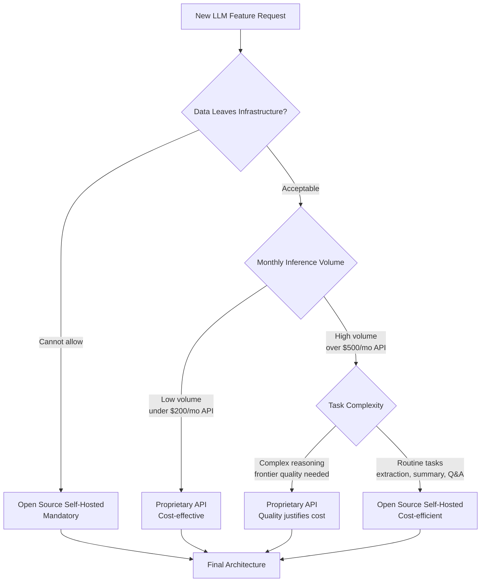

# Open Source vs Proprietary LLMs: Which to Choose?

The "open vs closed" LLM debate generates a lot of heat and not much clarity. Advocates of open source models emphasize privacy, cost, and control. Advocates of proprietary APIs emphasize capability and simplicity. Both are right about their claims and both are wrong to treat this as a binary choice.

In production systems, this is not an architectural decision made once — it is a routing decision made per request. Different tasks have different requirements, and the best-engineered AI systems I have seen use open source models for high-volume routine tasks and proprietary APIs for complex reasoning where quality is measurable and critical.

The practical question is not which paradigm is better. It is: for this specific task, in this specific context, with this specific cost and compliance profile, what is the right choice? This guide gives you a framework for that decision, with numbers to back it up.

---

## Concept Overview

The open vs closed decision has six dimensions that matter in practice:

**Capability** — What can the model do, and how reliably? This is model-quality-per-task, not general benchmark scores.

**Cost** — API pricing versus GPU infrastructure cost amortized over inference volume.

**Privacy and data residency** — Where does your data go? Can it be used for training? Does it stay within your compliance boundary?

**Customizability** — Can you fine-tune the model? Control the system prompt and safety guardrails?

**Operational overhead** — Deployment, monitoring, scaling, model updates. API removes most of this; self-hosted adds all of it.

**Vendor dependency** — API price changes, model deprecations, outages, and terms of service changes you cannot control.

A comprehensive decision weighs all six dimensions, not just the one that is easiest to quantify.

---

## How It Works



---

## Capability Comparison

The capability gap between frontier proprietary models and the best open source models has narrowed significantly, but it has not closed.

### Where Proprietary Models Still Lead

**Complex multi-step reasoning** — Tasks that require synthesizing many pieces of information, maintaining coherent reasoning over long chains, and reaching non-obvious conclusions. GPT-4o and Claude 3.5 Sonnet still outperform Llama 3.3 70B and Qwen2.5 72B on the hardest reasoning benchmarks.

**Long document comprehension** — Processing and synthesizing 100k+ token documents. While open source models have added 128k context windows, quality at long context is lower than proprietary counterparts.

**Instruction following on complex, constrained tasks** — Generating structured output that must satisfy multiple simultaneous constraints (format, length, content, style). Proprietary models handle this more reliably.

**Vision and multimodal tasks** — GPT-4o, Gemini 2.0 Flash, and Claude 3.5 Sonnet have vision capabilities that outperform open multimodal models for most production tasks.

### Where Open Source Models Are Competitive

**Standard coding tasks** — Code generation, debugging, documentation, code review. Qwen2.5 Coder 32B is competitive with GPT-4o on common programming tasks.

**Extraction and classification** — Pulling structured data from text, classifying content, sentiment analysis. Fine-tuned open source models often outperform general-purpose proprietary models on domain-specific extraction.

**RAG-based Q&A** — When the answer is in the retrieved context, model capability is less of a limiting factor than retrieval quality. A good 8B model with good retrieval often matches a 70B model with poor retrieval.

**Summarization** — For summarizing structured content (articles, reports, meeting notes), 13B+ open source models perform at GPT-4 levels.

---

## Implementation Example

### Cost Calculation Framework

```python
from dataclasses import dataclass

@dataclass
class APIConfig:
    name: str
    input_cost_per_1m: float   # USD per 1M input tokens
    output_cost_per_1m: float  # USD per 1M output tokens
    requests_per_second: float

@dataclass
class SelfHostedConfig:
    name: str
    gpu_hourly_cost: float     # USD per GPU-hour
    throughput_rps: float      # Requests per second
    setup_cost: float          # One-time infrastructure setup

def calculate_monthly_api_cost(
    config: APIConfig,
    daily_requests: int,
    avg_input_tokens: int = 500,
    avg_output_tokens: int = 300,
) -> dict:
    """Calculate monthly cost for a proprietary API setup."""
    monthly_requests = daily_requests * 30
    monthly_input_tokens = monthly_requests * avg_input_tokens
    monthly_output_tokens = monthly_requests * avg_output_tokens

    input_cost = (monthly_input_tokens / 1_000_000) * config.input_cost_per_1m
    output_cost = (monthly_output_tokens / 1_000_000) * config.output_cost_per_1m
    total = input_cost + output_cost

    return {
        "monthly_requests": monthly_requests,
        "input_cost": round(input_cost, 2),
        "output_cost": round(output_cost, 2),
        "total_monthly": round(total, 2),
    }

def calculate_monthly_selfhosted_cost(
    config: SelfHostedConfig,
    daily_requests: int,
    avg_inference_seconds: float = 3.0,
) -> dict:
    """Calculate monthly cost for self-hosted inference."""
    monthly_requests = daily_requests * 30
    total_inference_hours = (monthly_requests * avg_inference_seconds) / 3600

    # GPU utilization: requests fit within capacity
    gpu_hours_needed = max(
        total_inference_hours / (config.throughput_rps * avg_inference_seconds),
        720  # Always-on server = 720 hours/month minimum
    )

    compute_cost = gpu_hours_needed * config.gpu_hourly_cost
    total = compute_cost + (config.setup_cost / 12)  # Amortize setup over a year

    return {
        "monthly_requests": monthly_requests,
        "gpu_hours": round(gpu_hours_needed, 1),
        "compute_cost": round(compute_cost, 2),
        "amortized_setup": round(config.setup_cost / 12, 2),
        "total_monthly": round(total, 2),
    }

# Model configurations
gpt4o = APIConfig("GPT-4o", input_cost_per_1m=2.50, output_cost_per_1m=10.00, requests_per_second=50)
claude_sonnet = APIConfig("Claude 3.5 Sonnet", input_cost_per_1m=3.00, output_cost_per_1m=15.00, requests_per_second=50)

llama70b_self = SelfHostedConfig(
    name="Llama 70B (2x RTX 3090)",
    gpu_hourly_cost=0.50,      # 2 × $0.25/hr electricity + amortization
    throughput_rps=2.0,
    setup_cost=4000,           # 2 × RTX 3090 ~$2k each
)

llama8b_self = SelfHostedConfig(
    name="Llama 8B (RTX 4090)",
    gpu_hourly_cost=0.25,
    throughput_rps=15.0,
    setup_cost=2500,           # RTX 4090
)

# Compare at different request volumes
for daily_requests in [1000, 10000, 100000]:
    print(f"\n=== {daily_requests:,} requests/day ===")
    print(f"GPT-4o API: ${calculate_monthly_api_cost(gpt4o, daily_requests)['total_monthly']:,.0f}/mo")
    print(f"Claude Sonnet: ${calculate_monthly_api_cost(claude_sonnet, daily_requests)['total_monthly']:,.0f}/mo")
    print(f"Llama 70B (self-hosted): ${calculate_monthly_selfhosted_cost(llama70b_self, daily_requests)['total_monthly']:,.0f}/mo")
    print(f"Llama 8B (self-hosted): ${calculate_monthly_selfhosted_cost(llama8b_self, daily_requests)['total_monthly']:,.0f}/mo")
```

Sample output:
```
=== 1,000 requests/day ===
GPT-4o API: $120/mo
Claude Sonnet: $171/mo
Llama 70B (self-hosted): $396/mo    ← API cheaper at low volume
Llama 8B (self-hosted): $219/mo

=== 10,000 requests/day ===
GPT-4o API: $1,200/mo
Claude Sonnet: $1,710/mo
Llama 70B (self-hosted): $420/mo    ← Self-hosted breaks even
Llama 8B (self-hosted): $228/mo

=== 100,000 requests/day ===
GPT-4o API: $12,000/mo
Claude Sonnet: $17,100/mo
Llama 70B (self-hosted): $720/mo    ← Self-hosted wins decisively
Llama 8B (self-hosted): $297/mo
```

---

## Privacy and Compliance Considerations

This is the dimension that is hardest to compromise on and easiest to reason about.

**Data sent to OpenAI/Anthropic APIs:**
- Is transmitted over the internet (HTTPS)
- May be retained for up to 30 days by default (policy-dependent)
- Can be opted out of model training (both companies offer this)
- Is subject to the provider's data processing agreements

**Data processed by a self-hosted model:**
- Never leaves your infrastructure
- Subject to your own data retention policies
- No third-party DPA required
- Eligible for use in regulated industries (healthcare, finance, legal) where data residency is mandatory

A common mistake I've seen in production systems is assuming API DPAs cover all compliance requirements. HIPAA, GDPR, SOC 2, and financial services regulations may impose requirements that API terms of service do not satisfy — even with enterprise agreements. If compliance is a concern, get legal review before choosing the API path for sensitive data.

---

## The Hybrid Architecture

The most sophisticated production systems use both:

```python
import anthropic
import ollama
from enum import Enum

class TaskComplexity(Enum):
    ROUTINE = "routine"       # Open source model
    COMPLEX = "complex"       # Proprietary API

def assess_complexity(task: str, context_length: int) -> TaskComplexity:
    """Heuristic to route tasks to appropriate model tier."""
    complex_indicators = [
        context_length > 4000,                          # Long context
        any(kw in task.lower() for kw in [
            "analyze", "synthesize", "compare", "evaluate",
            "strategy", "recommend", "complex", "nuanced"
        ]),
    ]

    if sum(complex_indicators) >= 1:
        return TaskComplexity.COMPLEX
    return TaskComplexity.ROUTINE

def routed_inference(task: str, context: str) -> str:
    """Route to open source or proprietary model based on task complexity."""
    prompt = f"{task}\n\nContext: {context}"
    complexity = assess_complexity(task, len(context))

    if complexity == TaskComplexity.ROUTINE:
        # Use local open source model
        response = ollama.chat(
            model="llama3.1:8b",
            messages=[{"role": "user", "content": prompt}]
        )
        return response["message"]["content"]
    else:
        # Use proprietary API for complex reasoning
        client = anthropic.Anthropic()
        response = client.messages.create(
            model="claude-3-5-sonnet-20241022",
            max_tokens=1024,
            messages=[{"role": "user", "content": prompt}]
        )
        return response.content[0].text
```

---

## Decision Framework

| Situation | Recommendation |
|---|---|
| Data is sensitive / cannot leave infra | Open source (mandatory) |
| Low request volume (< 1k/day) | Proprietary API (lower total cost) |
| High request volume (> 10k/day) | Open source self-hosted |
| Need fine-tuning for domain | Open source (proprietary fine-tuning is expensive) |
| Complex reasoning, frontier quality needed | Proprietary API |
| Standard coding, extraction, summarization | Open source (competitive quality) |
| Multilingual (non-English) | Open source (Qwen2.5) or proprietary |
| Vision / multimodal tasks | Proprietary API (currently superior) |
| Need model inspection or interpretability | Open source (inspect weights/attention) |
| Rapid prototyping, small team | Proprietary API (no infra overhead) |

---

## Best Practices

**Start with proprietary APIs, migrate to open source when justified.** API-first development is faster for prototyping. Once you have validated demand and understand your volume and data requirements, evaluate whether open source makes sense for production.

**Track API costs from day one.** API costs grow non-linearly with product success. Instrument every API call with token counts and route tracking. At $1k/month, evaluate self-hosting. At $3k/month, act on it.

**Use open source for eval, even if you deploy proprietary.** Running your eval suite against open source models costs almost nothing locally. This tells you how much quality you are paying for with the API premium.

**Version your prompts and model versions together.** Whether using proprietary APIs or open source models, treat the model version as part of your deployment config. API model changes (gpt-4 → gpt-4-turbo) can break prompts without notice.

---

## Common Mistakes

1. **Defaulting to proprietary APIs without a volume analysis.** At 50,000 requests per day, a well-configured open source stack costs 5–10× less than GPT-4o. This analysis takes one hour and can save tens of thousands per month.

2. **Treating "open source" as meaning "privacy compliant."** A self-hosted model is private only if your infrastructure is properly secured. The model itself does not provide privacy guarantees — your deployment does.

3. **Ignoring operational overhead in the cost comparison.** Self-hosting adds GPU management, model updates, scaling, and on-call overhead. For small teams without ML infrastructure experience, this cost can exceed the API savings.

4. **Assuming proprietary API quality is always higher.** For specific tasks — extraction, classification, domain-specific Q&A — a fine-tuned 8B model frequently outperforms GPT-4o. Test before assuming.

5. **Not building vendor exit infrastructure.** If you are using a proprietary API, maintain the abstraction layer that would let you switch. Use standard OpenAI-compatible endpoints where possible, so switching to a different provider or self-hosted deployment requires a config change, not a code rewrite.

---

## Summary

The open vs closed LLM decision is a cost-quality-compliance trade-off that should be re-evaluated as your product scales. Proprietary APIs are the right start for most teams — lower operational overhead, frontier capability, faster development. Open source becomes compelling — and often mandatory — when volume grows, data privacy matters, or you need the fine-tuning control that proprietary models do not offer. The most effective production architectures use both, routing tasks by complexity and compliance requirements.

---

## Related Articles

- [Open Source LLMs Guide: Complete Ecosystem Overview](/blog/open-source-llm-guide)
- [Running LLMs Locally with Ollama: Complete Guide](/blog/ollama-tutorial)
- [OpenAI API Tutorial](/blog/openai-api-tutorial)

---

## FAQ

**Q: At what request volume does self-hosting become cheaper than the API?**
For GPT-4o with average-length requests, the crossover is roughly 5,000–10,000 requests per day, assuming you run a self-hosted 70B model on cloud GPUs. With owned hardware, the crossover is lower. Calculate your specific numbers with the cost framework above.

**Q: Can I use GPT-4 outputs to build a training dataset for open source models?**
OpenAI's terms of service prohibit using their model outputs to train competing AI models. You can use outputs for your own products, but training competing models violates the ToS. Anthropic has similar restrictions. Using Llama 70B locally as a teacher for distillation is fully permissible.

**Q: Is the quality gap between GPT-4o and Llama 3.3 70B closing?**
Yes, meaningfully. On practical task benchmarks (coding, extraction, summarization), the gap is now 5–15% depending on the task. On complex reasoning and long-context synthesis, GPT-4o maintains a clearer lead. The gap continues to narrow with each model generation.

**Q: What is the minimum team size to justify self-hosting?**
It is less about team size and more about having someone who can manage GPU infrastructure and model updates. A single ML engineer can manage a small Ollama/vLLM deployment. The real minimum is having at least one engineer who understands the stack, plus the hardware budget.

<script type="application/ld+json">
{
  "@context": "https://schema.org",
  "@type": "FAQPage",
  "mainEntity": [
    {
      "@type": "Question",
      "name": "At what request volume does self-hosting become cheaper than the API?",
      "acceptedAnswer": {
        "@type": "Answer",
        "text": "For GPT-4o with average-length requests, the crossover is roughly 5,000–10,000 requests per day running a self-hosted 70B model on cloud GPUs. With owned hardware, the crossover is lower."
      }
    },
    {
      "@type": "Question",
      "name": "Can I use GPT-4 outputs to build a training dataset for open source models?",
      "acceptedAnswer": {
        "@type": "Answer",
        "text": "OpenAI's terms of service prohibit using their model outputs to train competing AI models. Using Llama 70B locally as a teacher for distillation is fully permissible under Llama's license."
      }
    },
    {
      "@type": "Question",
      "name": "Is the quality gap between GPT-4o and Llama 3.3 70B closing?",
      "acceptedAnswer": {
        "@type": "Answer",
        "text": "Yes. On practical tasks like coding, extraction, and summarization, the gap is now 5–15%. On complex reasoning and long-context synthesis, GPT-4o maintains a clearer lead. The gap continues to narrow with each model generation."
      }
    },
    {
      "@type": "Question",
      "name": "What is the minimum team size to justify self-hosting?",
      "acceptedAnswer": {
        "@type": "Answer",
        "text": "It is less about team size and more about having at least one engineer who can manage GPU infrastructure and model updates. The real minimum is engineering competence plus the hardware budget."
      }
    }
  ]
}
</script>
