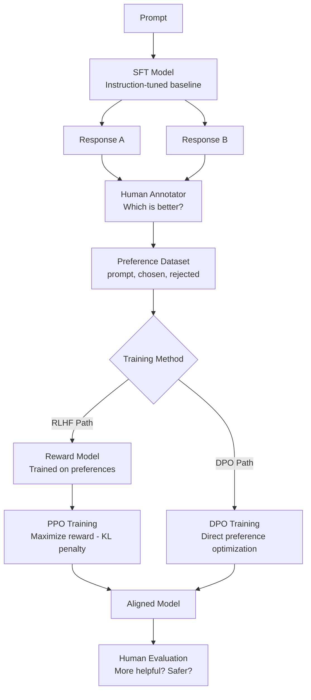

# RLHF Explained: How LLMs Learn from Human Feedback

An instruction-tuned LLM knows how to follow instructions — but it does not inherently know what "good" means to human users. A model trained only with SFT will occasionally produce outputs that are technically correct but unnecessarily verbose, unnecessarily hedged, or subtly misaligned with what the user actually wanted. It has learned the pattern of helpful responses, not the substance of helpfulness.

RLHF (Reinforcement Learning from Human Feedback) addresses this by training the model to maximize a reward that reflects human preference. The reward is learned from human comparisons: given two model responses, which is better? Humans label thousands of these pairs, a reward model learns their preferences, and then the main language model is optimized to produce outputs the reward model scores highly.

The full RLHF pipeline — SFT, reward model training, PPO — is complex, unstable, and requires significant infrastructure. This is why DPO (Direct Preference Optimization) has largely replaced it for most practitioners. DPO achieves the same goal — aligning the model to human preferences — without a separate reward model and without RL training. Both approaches are covered here.

## Concept Overview

**Stage 1: Supervised Fine-Tuning (SFT).** The base model is fine-tuned on high-quality instruction-response demonstrations. This produces an instruction-following model that can handle most tasks but has not been optimized for human preference.

**Stage 2: Reward Model Training.** Human annotators compare pairs of model responses (A vs B) for the same prompt. A reward model — often a smaller LLM with a regression head — learns to predict which response humans prefer. The reward model is trained to output a scalar score reflecting response quality.

**Stage 3: PPO (Proximal Policy Optimization).** The SFT model is further fine-tuned using RL. At each step: generate a response, score it with the reward model, update the policy to increase the probability of high-reward responses. A KL divergence penalty prevents the model from straying too far from the SFT distribution (which would cause reward hacking).

**DPO: The Simpler Alternative.** DPO reformulates the RLHF objective as a supervised learning problem. Instead of training a separate reward model and running PPO, DPO directly optimizes on preference pairs using a closed-form loss derived from the optimal policy under the RLHF objective. One training stage, no RL, more stable.

**Which to use:** DPO for most cases. Full RLHF when you have a high-quality reward model, complex multi-step reasoning tasks, or need the model to explore beyond the training distribution.

## How It Works



In practice, the arrow from human annotator to preference dataset is the most expensive part. Each annotation requires showing a human two model responses and asking for a comparison. At the scale needed for production alignment (thousands to tens of thousands of pairs), annotation costs dominate.

## Implementation Example

### Creating a Preference Dataset

```python
# Preference data format for DPO and RLHF
# Each example: prompt messages + chosen response messages + rejected response messages

preference_data = [
    {
        "prompt": [
            {"role": "user", "content": "Explain how gradient descent works."}
        ],
        "chosen": [
            {
                "role": "assistant",
                "content": (
                    "Gradient descent is an optimization algorithm that minimizes a loss function "
                    "by iteratively moving in the direction of steepest descent. "
                    "At each step, compute the gradient of the loss with respect to the parameters, "
                    "then subtract a fraction (the learning rate) of that gradient from the parameters. "
                    "This moves parameters in the direction that reduces loss fastest. "
                    "The learning rate controls step size — too large causes divergence, too small means slow convergence."
                )
            }
        ],
        "rejected": [
            {
                "role": "assistant",
                "content": (
                    "Gradient descent is an algorithm used in machine learning. "
                    "It helps models learn from data. The model adjusts its parameters "
                    "to minimize the error. It works by using gradients."
                )
            }
        ]
    },
    # ... thousands more preference pairs
]
```

### DPO Training with TRL

DPO is the preferred approach for most practitioners. It requires less infrastructure and is more stable than PPO:

```python
from transformers import AutoModelForCausalLM, AutoTokenizer
from trl import DPOTrainer, DPOConfig
from datasets import Dataset
import torch

MODEL_PATH = "./merged-sft-model"  # Start from your SFT model

tokenizer = AutoTokenizer.from_pretrained(MODEL_PATH)
tokenizer.pad_token = tokenizer.eos_token

# Load the SFT model
model = AutoModelForCausalLM.from_pretrained(
    MODEL_PATH,
    torch_dtype=torch.bfloat16,
    device_map="auto",
)

# Optionally add LoRA for memory efficiency
from peft import LoraConfig, get_peft_model, TaskType

lora_config = LoraConfig(
    task_type=TaskType.CAUSAL_LM,
    r=16,
    lora_alpha=16,
    target_modules=["q_proj", "k_proj", "v_proj", "o_proj"],
    lora_dropout=0.0,
    bias="none",
    inference_mode=False,
)
model = get_peft_model(model, lora_config)

# Load preference dataset
dpo_dataset = Dataset.from_list(preference_data)
split = dpo_dataset.train_test_split(test_size=0.1, seed=42)

dpo_config = DPOConfig(
    output_dir="./dpo-output",
    num_train_epochs=1,                # DPO usually needs only 1 epoch
    per_device_train_batch_size=1,
    gradient_accumulation_steps=8,
    learning_rate=5e-7,               # Much lower than SFT — preserve capabilities
    bf16=torch.cuda.is_bf16_supported(),
    warmup_ratio=0.1,
    lr_scheduler_type="cosine",
    # DPO-specific parameters
    beta=0.1,                         # KL penalty coefficient — higher = closer to SFT model
    max_length=2048,                  # Max total length (prompt + response)
    max_prompt_length=512,            # Max prompt length
    # Reference model
    # ref_model=None means the ref model is the unmodified starting model
    logging_steps=10,
    eval_strategy="steps",
    eval_steps=50,
    save_strategy="steps",
    save_steps=100,
    report_to="none",
)

trainer = DPOTrainer(
    model=model,
    ref_model=None,           # Auto-creates reference from model before training
    tokenizer=tokenizer,
    train_dataset=split["train"],
    eval_dataset=split["test"],
    args=dpo_config,
)

print("Starting DPO training...")
trainer.train()
trainer.model.save_pretrained("./dpo-adapter")
tokenizer.save_pretrained("./dpo-adapter")
print("DPO training complete.")
```

### Reward Model Training (for Full RLHF)

```python
from transformers import AutoModelForSequenceClassification, AutoTokenizer
from trl import RewardTrainer, RewardConfig

# Reward model — typically a smaller model (same or smaller than SFT model)
# Fine-tuned for classification: given a response, output a scalar reward
reward_model = AutoModelForSequenceClassification.from_pretrained(
    "meta-llama/Meta-Llama-3-8B-Instruct",
    num_labels=1,           # Scalar reward output
    torch_dtype=torch.bfloat16,
    device_map="auto",
)
reward_tokenizer = AutoTokenizer.from_pretrained("meta-llama/Meta-Llama-3-8B-Instruct")
reward_tokenizer.pad_token = reward_tokenizer.eos_token

# RewardTrainer expects: input_ids_chosen, attention_mask_chosen,
#                        input_ids_rejected, attention_mask_rejected

def format_for_reward_training(example):
    """Format preference pair for reward model training."""
    chosen_text = reward_tokenizer.apply_chat_template(
        example["prompt"] + example["chosen"], tokenize=False
    )
    rejected_text = reward_tokenizer.apply_chat_template(
        example["prompt"] + example["rejected"], tokenize=False
    )
    return {"chosen": chosen_text, "rejected": rejected_text}

reward_dataset = dpo_dataset.map(format_for_reward_training)

reward_config = RewardConfig(
    output_dir="./reward-model",
    num_train_epochs=1,
    per_device_train_batch_size=2,
    gradient_accumulation_steps=4,
    learning_rate=2e-5,
    bf16=True,
    max_length=1024,
    logging_steps=10,
    save_strategy="epoch",
    report_to="none",
)

reward_trainer = RewardTrainer(
    model=reward_model,
    tokenizer=reward_tokenizer,
    train_dataset=split["train"],
    eval_dataset=split["test"],
    args=reward_config,
)

reward_trainer.train()
reward_trainer.model.save_pretrained("./reward-model-weights")
```

### Evaluating Alignment Quality

```python
from openai import OpenAI
import json

client = OpenAI()

def compare_responses(prompt, sft_response, dpo_response, n_votes=3):
    """
    Use GPT-4 to compare SFT vs DPO responses.
    Run multiple times and aggregate to reduce variance.
    """
    votes = {"sft": 0, "dpo": 0, "tie": 0}

    for _ in range(n_votes):
        judge_prompt = f"""Compare these two responses to the user's question.

Question: {prompt}

Response A: {sft_response}

Response B: {dpo_response}

Which response is more helpful, accurate, and appropriate?
Reply with just "A", "B", or "Tie"."""

        result = client.chat.completions.create(
            model="gpt-4o",
            messages=[{"role": "user", "content": judge_prompt}],
            temperature=0.3,
        )

        answer = result.choices[0].message.content.strip().upper()
        if "A" in answer and "B" not in answer:
            votes["sft"] += 1
        elif "B" in answer and "A" not in answer:
            votes["dpo"] += 1
        else:
            votes["tie"] += 1

    return votes

# Compare SFT vs DPO on test prompts
test_prompts = [
    "What are the risks of using a password manager?",
    "Write a function to validate an email address in Python.",
    "My team disagrees on code review standards. What should I do?",
]

print(f"{'Prompt':<50} {'SFT':>8} {'DPO':>8} {'Tie':>8}")
print("-" * 76)
for prompt in test_prompts:
    # Generate from both models (simplified)
    sft_resp = "..." # generate from SFT model
    dpo_resp = "..." # generate from DPO model
    votes = compare_responses(prompt, sft_resp, dpo_resp)
    print(f"{prompt[:48]:<50} {votes['sft']:>8} {votes['dpo']:>8} {votes['tie']:>8}")
```

## Best Practices

**Start with DPO, not full RLHF.** DPO requires one training stage, no reward model, and is significantly more stable. The quality ceiling for DPO is slightly lower than full RLHF for complex reasoning tasks, but for most alignment objectives — tone, format, helpfulness — DPO is sufficient and much easier to operate.

**Quality of preference pairs matters more than quantity.** Preference data requires that the chosen response is clearly better than the rejected one. Ambiguous pairs (where reasonable annotators would disagree) are harmful — they add noise to the reward signal. Filter for pairs where the quality gap is clear and the chosen response genuinely represents what you want.

**Use a low learning rate for DPO.** The DPO loss function is sensitive to learning rate. Values in the range `1e-7` to `5e-6` are typical. Higher rates cause the model to overfit to the preference format and degrade general capabilities quickly.

**Monitor KL divergence during DPO training.** The `beta` parameter controls how closely the DPO model stays to the reference (SFT) model. A higher beta means stronger constraint — the model moves less. If you see general capability degradation, increase `beta`. If the model is not aligning well to preferences, decrease it.

## Common Mistakes

1. **Starting DPO from a poor SFT model.** DPO shifts the model's output distribution toward the preferred responses — but it cannot compensate for a fundamentally undertrained SFT model. DPO works best when the SFT model already produces reasonable outputs; it then refines the ranking and style.

2. **Using the same model for both generating training responses and alignment.** If you generate your preference pairs using the same model you are trying to align, the training distribution is biased toward that model's existing tendencies. Ideally, use a separate sampling process or a stronger model to generate diverse response candidates.

3. **Training for too many epochs with DPO.** Unlike SFT, where more data and epochs generally help, DPO can overfit aggressively to the preference format. One or two epochs is almost always sufficient. Watch eval loss — if it rises after the first epoch, stop.

4. **Ignoring reward hacking.** In full RLHF with PPO, the model will find shortcuts to maximize reward that do not reflect genuine quality improvement. Common patterns: extremely verbose responses, formulaic hedging phrases, or specific sentence structures that the reward model overvalues. Monitor generated outputs qualitatively, not just reward scores.

5. **Not preserving the reference model.** DPO requires a reference model (the unmodified SFT checkpoint) to compute the KL divergence term. If you do not save the SFT model before running DPO, you cannot properly configure the trainer. Always checkpoint the SFT model before starting DPO.

## Summary

RLHF aligns LLMs with human preferences through a three-stage pipeline: supervised fine-tuning, reward model training, and PPO reinforcement learning. The full pipeline produces highly aligned models but requires significant infrastructure and expertise to operate reliably.

DPO offers a simpler alternative that eliminates the separate reward model and replaces PPO with a stable supervised loss. For most practical alignment objectives — improving helpfulness, enforcing response style, reducing specific bad behaviors — DPO delivers strong results with far less complexity.

The quality of preference data is the primary driver of alignment success with either approach.

## Related Articles

- [LLM Fine-Tuning Guide: LoRA, QLoRA, and Full Fine-Tuning](/blog/llm-fine-tuning-guide/) — Complete fine-tuning pipeline including alignment
- [Instruction Tuning Explained](/blog/instruction-tuning/) — SFT: the foundation RLHF builds on
- [Training LLMs with HuggingFace](/blog/huggingface-training/) — TRL DPOTrainer and PPOTrainer in practice
- [Synthetic Data for LLM Training](/blog/synthetic-data-llm/) — Generating preference pairs with strong models
- [LLM Evaluation Metrics](/blog/llm-evaluation/) — Measuring alignment quality

## FAQ

**What is the difference between RLHF and DPO?**
RLHF trains a separate reward model from human preference pairs, then uses PPO to optimize the LLM against that reward model. DPO bypasses both — it directly optimizes the LLM on preference pairs using a loss function derived from the optimal RLHF policy. DPO is simpler, more stable, and requires no RL training. RLHF has a higher ceiling for complex tasks where reward modeling captures nuance DPO cannot.

**How many preference pairs do I need for DPO?**
For domain-specific alignment (style, format, tone), 500–2,000 high-quality preference pairs is sufficient. For broad alignment improvements across many topics, 10,000–100,000 pairs is more typical. Quality matters more than quantity — ambiguous pairs with unclear preference differences actively harm training.

**What is reward hacking and how do I prevent it?**
Reward hacking occurs in PPO-based RLHF when the model learns to maximize the reward model's score through shortcuts that do not reflect genuine quality — such as generating verbose responses that trigger certain patterns the reward model overvalues. Prevention: monitor generated outputs qualitatively, use a diverse reward model, apply KL divergence penalties, and run periodic human evals alongside automated reward scores.

**Can I use DPO without an SFT stage?**
DPO is designed to refine an already instruction-tuned model. Starting DPO from a raw base model produces poor results — the model has no baseline instruction-following capability for DPO to build on. Always run at least a minimal SFT stage before DPO.

<script type="application/ld+json">
{
  "@context": "https://schema.org",
  "@type": "FAQPage",
  "mainEntity": [
    {
      "@type": "Question",
      "name": "What is the difference between RLHF and DPO?",
      "acceptedAnswer": {
        "@type": "Answer",
        "text": "RLHF trains a separate reward model from human preferences, then uses PPO to optimize the LLM against it. DPO directly optimizes the LLM on preference pairs using a loss derived from the optimal RLHF policy — no RL, no separate reward model. DPO is simpler and more stable; RLHF has a higher ceiling for complex reasoning tasks."
      }
    },
    {
      "@type": "Question",
      "name": "How many preference pairs do I need for DPO?",
      "acceptedAnswer": {
        "@type": "Answer",
        "text": "For domain-specific alignment, 500–2,000 high-quality preference pairs is sufficient. For broad alignment improvements, 10,000–100,000 is typical. Quality matters more than quantity — ambiguous pairs actively harm training."
      }
    },
    {
      "@type": "Question",
      "name": "What is reward hacking and how do I prevent it?",
      "acceptedAnswer": {
        "@type": "Answer",
        "text": "Reward hacking occurs when the model learns shortcuts to maximize reward scores without genuine quality improvement — like verbosity or formulaic phrases the reward model overvalues. Prevention: monitor outputs qualitatively, use diverse reward models, apply KL divergence penalties, and run periodic human evaluations."
      }
    },
    {
      "@type": "Question",
      "name": "Can I use DPO without an SFT stage?",
      "acceptedAnswer": {
        "@type": "Answer",
        "text": "DPO requires a baseline instruction-following model to build on. Starting from a raw base model produces poor results. Always run at least a minimal SFT stage before DPO."
      }
    }
  ]
}
</script>
